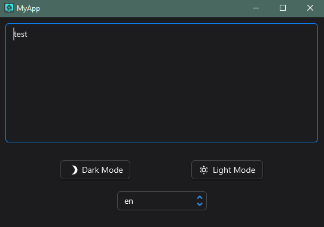
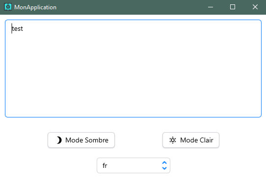

# JavaFX Modular Gradle Demo 

## 🎯 Objective
**JavaFX Modular Gradle Demo** was bootstrapped with the javafx-gradle-modular jDeploy project template.  
It provides a basic structure for a JavaFX application, as well as configuration to deploy the app as a native desktop app on Mac, Linux, and Windows.





## 🚀 Main Features
- **JavaFX Framework**: A robust base for building a smooth and modern UI.
- **Persistence of user settings** : 
  - Window position on the screen
  - Theme used
  - Text input
- **Built-in Themes**:
    - 🌙 Dark Mode
    - ☀️ Light Mode
- **Internationalization (i18n) Support**: Ready for multiple languages.
- **Advanced UI Library**: **AtlantaFX** pre-configured for an enhanced application look.
- **Complete Gradle Setup**: Advanced configuration for compiling, packaging, and distributing the application easily.
- **Automated Deliverable Generation**: For Windows, Linux, and macOS
- **Automatic Updates**: Users of your app will receive automatic updates to your latest version.
- **GitHub Actions Workflows**:
    - 📦 Automatic builds on tag and commit
    - 🚀 GitHub releases with all deliverables

## 📦 Installation & Usage
### 1️⃣ Prerequisites
- **JDK 21** (Temurin recommended)
- **Gradle** (if not included in the wrapper)

### 3️⃣ Run the Application in Development Mode
```sh
./gradlew run
```

## 🔧 Build and Generate Deliverables
To generate an executable for your OS, use one of the following commands:
```sh
./gradlew buildExecutableJar    # Windows EXE
```

## Publish to npm or GitHub Releases

1. Download [jDeploy](https://github.com/shannah/jdeploy-desktop-gui/releases/tag/master).
2. Open this project in the jDeploy GUI.
3. Press "Publish"

For more details on this process, see the [Getting Started](https://www.jdeploy.com/docs/manual/#_getting_started) section of the jDeploy manual.

## 🛠️ Contribution
Contributions are welcome! Feel free to suggest improvements via issues or pull requests.

## 📄 License
This project is licensed under the **MIT** License. You are free to use and modify it as needed.

---
💡 **JavaFX Modular Gradle Demo** allows you to start a JavaFX project without worrying about complex configurations. Enjoy and create powerful applications right from the start! 🚀

## Credits

This template was adapted from https://github.com/JulienTroudet/easyJavaFXSetup, the fantastic JavaFX starter project created by Julien Troudet.
